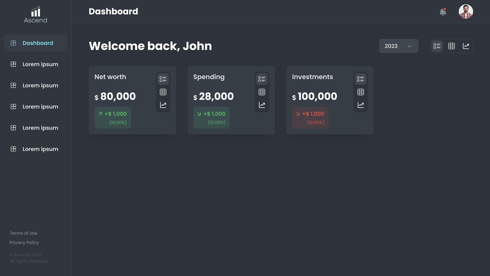
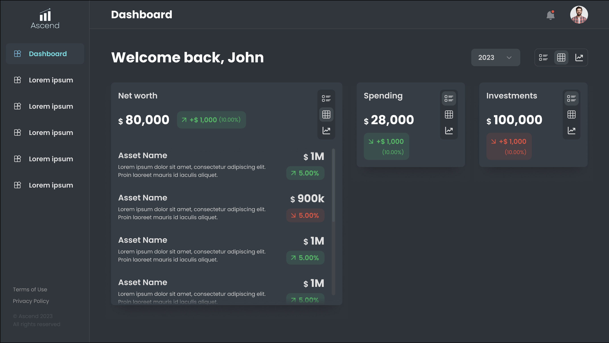
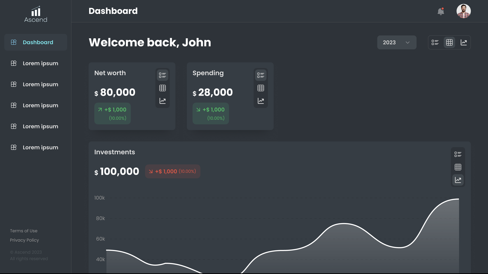
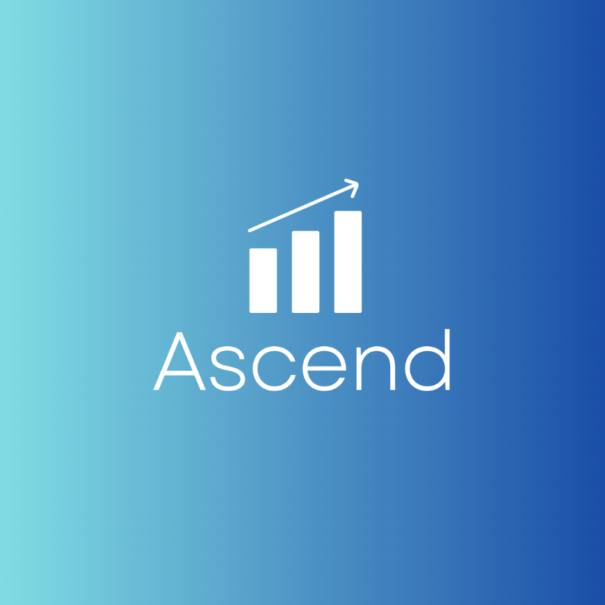

# Ascend

Ascend is a minimalist personal finance application designed for those who value simplicity and customization. With a widget-based approach, users can tailor their experience to focus on the financial data that matters most to them.

**Core Features:**

* Customizable Widgets: Choose what you want to see, be it a simple value, a recent transactions table, or a trend graph.

* User-Centric Design: We've reduced information overload, ensuring that every interaction is meaningful and intuitive.

Here's a demo of our user dashboard, the core feature of this application:

The left sidebar hosts multiple 'Dashboards', each representing a distinct space where you can add and customize the widgets you wish to display. Within these dashboards, you have the option to sort financial information by date. Additionally, each widget features a small menu for further actions.

**You can set your financial widgets to display your financial info in various formats**

**Here's another example**

**Roadmap:**

* Add a profile and settings screen.

* Add color customization options.

* Drag and drop customization support (currently we place widgets according to a grid layout).

